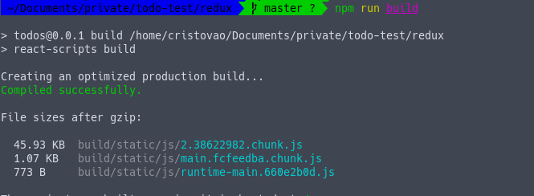
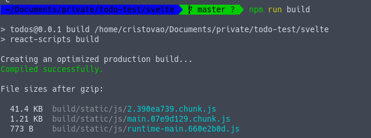

# Intro
This is started as personal joke: using svelte/store as a hook instead of react-redux

## Implementation
You can check the svelte/store hooks in [this file](./svelte/src/store/use-store.js).

I could use the store without using a reducer, but to be fair I choose to use the reducer
pattern. The `useReducerWithStore` hook is similar to react's `userReducer`, but takes
the store instead of the initial state (to share the global value).

The rest of the code need only small changes, and only in the `containers` folder as well
as removing the react-redux provider from the index.js

# Pros-cons of svelte/store

## Cons
- Action needs to be dispatched for every reducer (hook call). This is not necessarily bad
  because it makes code more clear and fast, and can be solved by a
  `dispatchAll(dispatchArr, action)` helper
- No amazing dev tools that I know of (yet)

## Pros
- Slightly faster execution, due to less reducer calls. As the first con says, the action
  runs only in the reducers it needs. Should not matter too much, as switch statements are pretty fast
- Natural bundle split and tree shaking. This a big improvement. No need for special setups,
  as only imported reducers will be bundled
- Smaller bundle size
- Much faster execution due to no unnecessary comparisons to detect state change.
  React-redux does some logic to check if any given `mapStateToProps` result has changed,
  so react can trigger a re-render. This happens for every `mapStateToProps`, on every `dispatch` call.
  By using the combination of `useState`, `useEffect` and the subscription model, we now need
  only the necessary render calls, without any comparisons.
  > This grows linearly with both the number of reducers and connected components!!

# Bundle size

## Compressed build size
- Redux:  45.93 + 1.07 = 47.00kB
- Svelte: 41.40 + 1.21 = 42.61kB
- Diff: 6.81kB ~= -14.5%

This is the result from the build log, as you can see:

### Redux

### Svelte/store

## Bundle analysis (uncompressed)
- Redux:  152.26kB
- Svelte: 136.66kB
- Diff: 15.60kB ~= -10.2%

This is the result of using the `source-map-explorer` tool, as you can see:

### Redux

### Svelte/store
